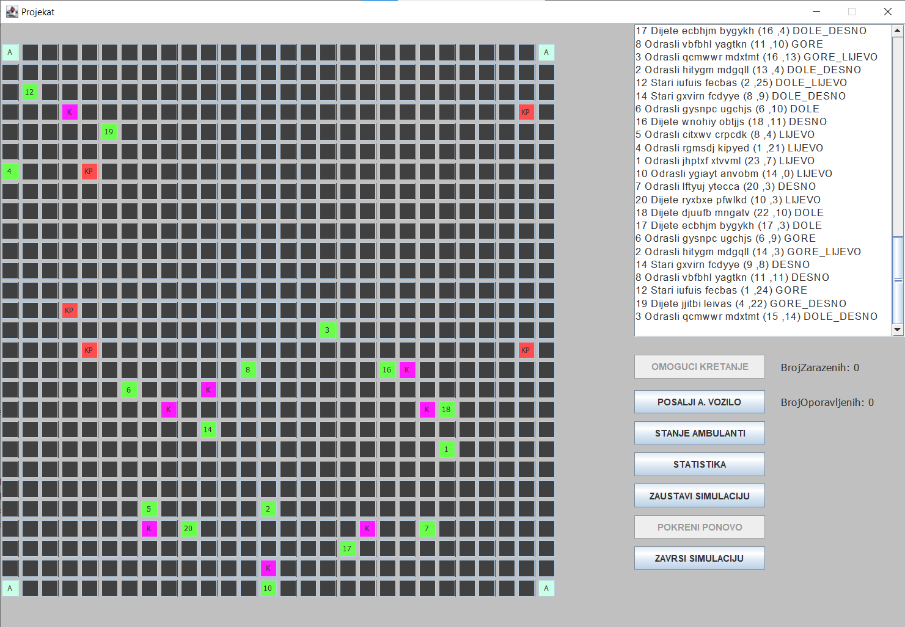

# Java Projekat

## General info
Projekat napravljen u svrhu vjezbanja Jave.Fokus je na simuliranju rada tredova gdje svakog covjeka predstavlja jedan thread koji se nasumicno krece po mapi, u slucaju da kontrolni punkt
izmjeri povisenu temperaturu covjeka zaustavlja njegovo kretanje i pauzira dati thread.Moguce je poslati ambulantu po zarazenog covjeka koja se krece najkracim putem do covjeka i nazad
do bolnice.Simulaciju je moguce pauzirati i nastaviti u svakom trenutku.
	
## Technologies
Project is created with:
* Java

## Screenshots

